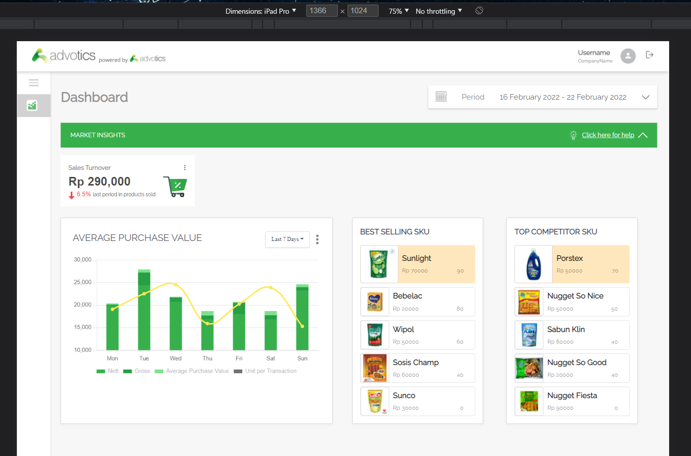
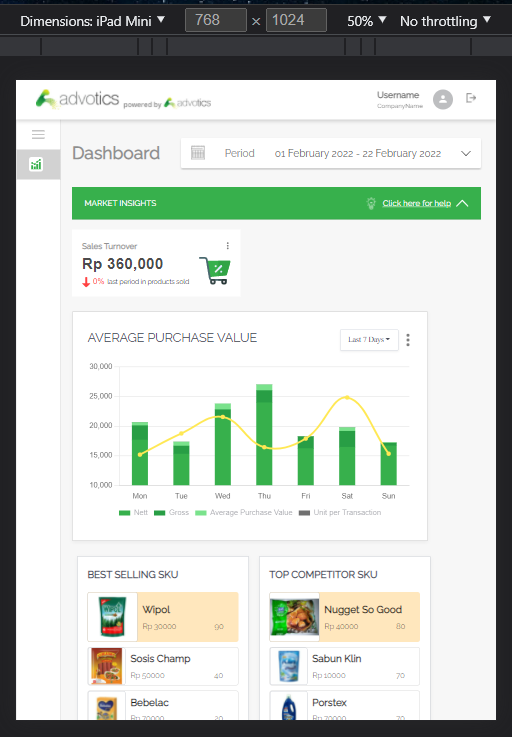
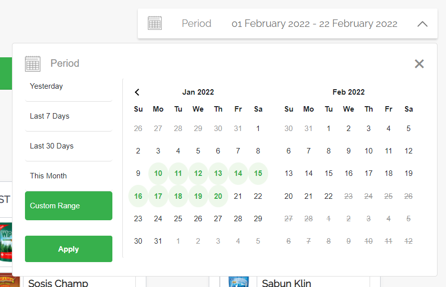

# Advotics Interview Test

> A web application that contains a dashboard for users to monitor sales progress

## Description

> This Web application is developed for Advotics interview test. This test is to develop a dashboard. A Dashboard is a user interface that organizes and presents complex data with easy to digest visualization. This web app is deployed on Vercel using CI/CD from Vercelbot. You can access the web application [here](https://advotics-interview-test.vercel.app/)

## Features

- Sliding sidebar
- Date range picking using calendar and period options
- Accordion of Market Insight
- Fluid sales chart based on chosed period options
- SKU Card of top 5 sold products

## Libraries and Packages Used

- next js
- bootstrap and react-bootstrap
- bootstrap-daterangepicker and react-bootstrap-daterangepicker
- chart.js and react-chartjs-2
- hamburger-react
- moment

## Views

- Desktop view

  

- Tablet view
  
  

- Period filter

  

> Due to no mock up design for mobile, mobile view is not implemented yet

## Setup

You need to have Node JS and npm installed on your computer.

## How to run

- Download this repository or clone it by
  ```
  git clone https://github.com/malikrafsan/Advotics-Interview-Test.git
  ```
- Change directory to the cloned repo
  ```sh
  cd Advotics-Interview-Test
  ```
- Install dependencies and run locally
  ```
  npm install
  npm run dev
  ```
- Open your web browser on `http://localhost:3000/`
- You can also access the deployed web app [here](https://advotics-interview-test.vercel.app/)

## Developed by

- Malik Akbar Hashemi Rafsanjani
